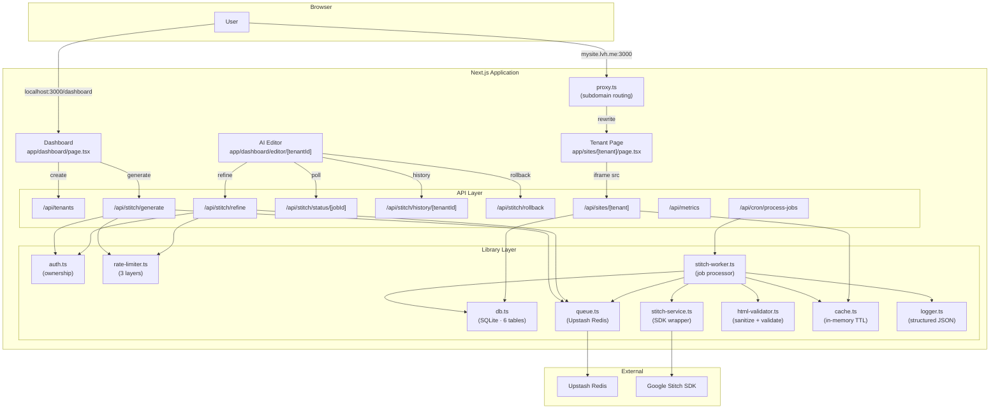
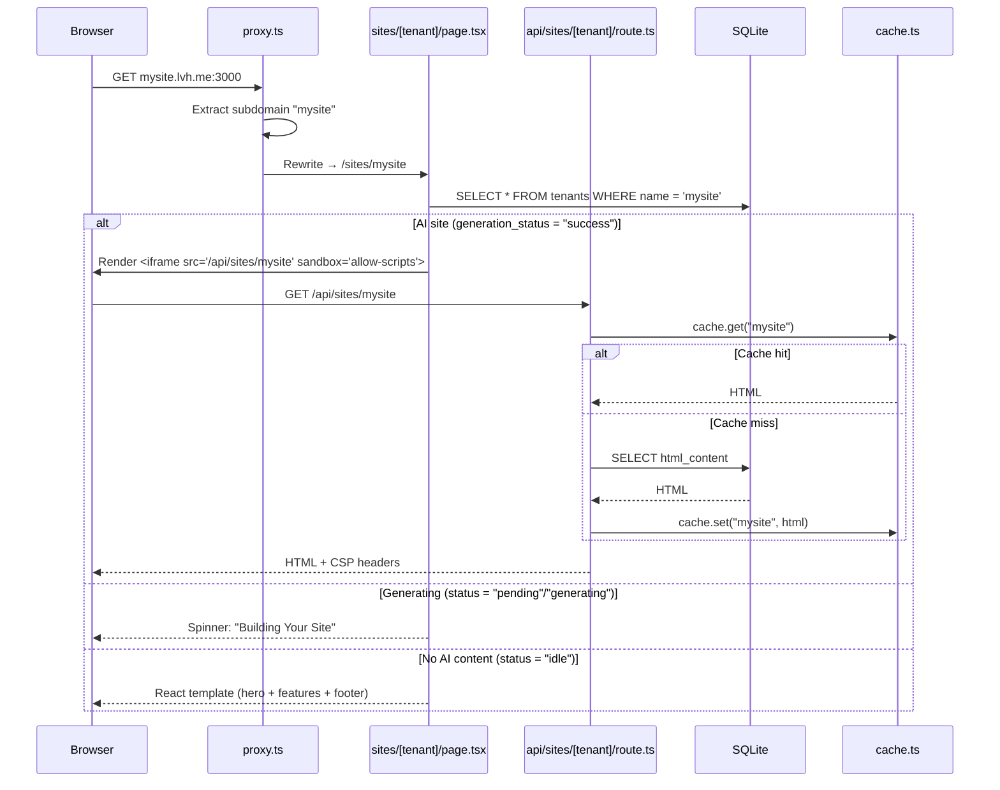
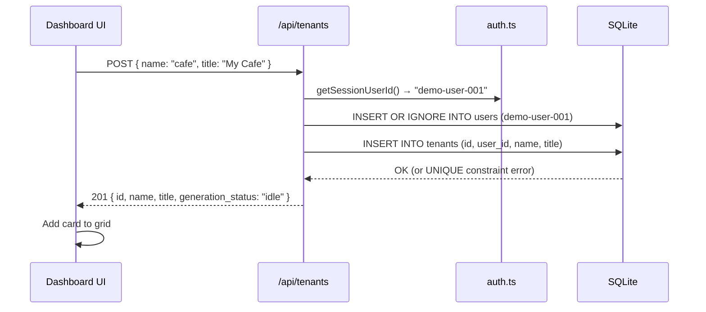
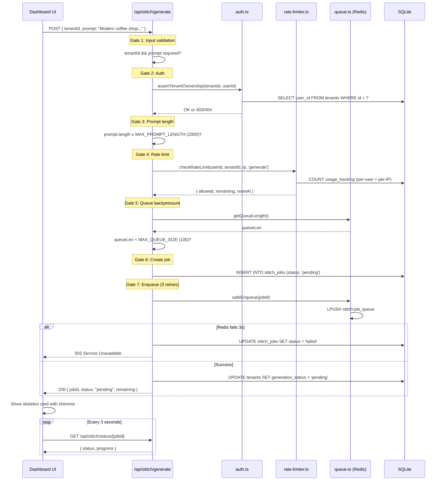
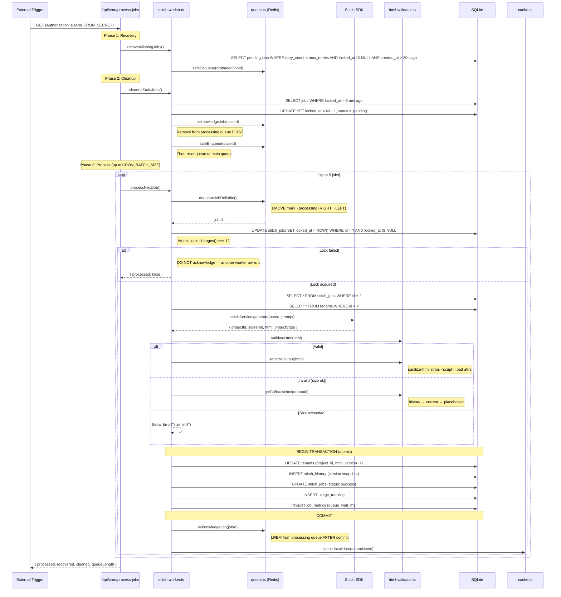
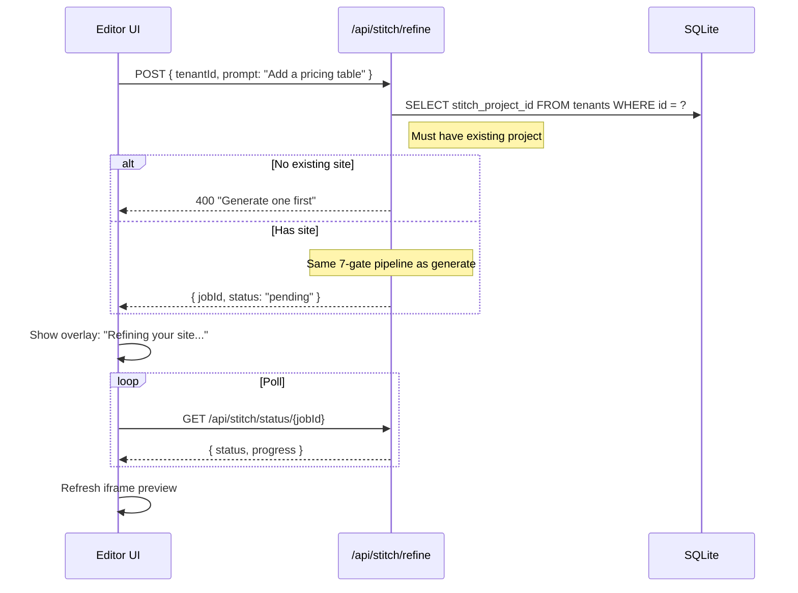
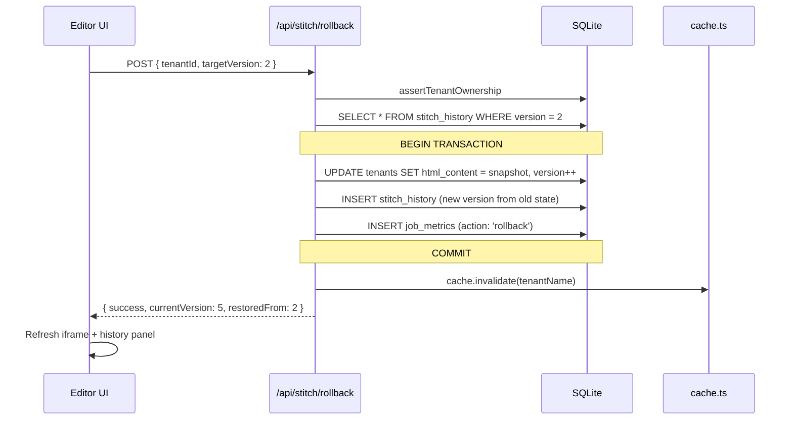
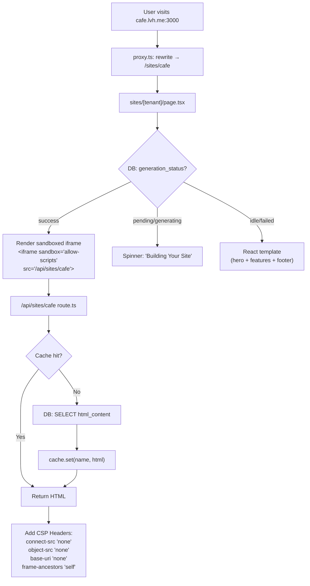
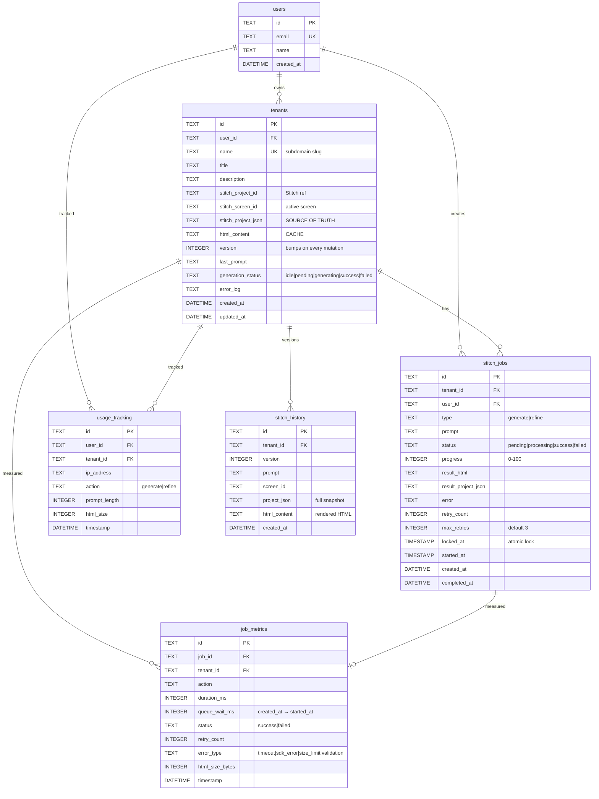

# Walkthrough: Complete Codebase Flow — Stitch SDK Integration

> Last Updated: After Review Round 2 — All 5 critical fixes applied.

---

## Table of Contents

1. [System Overview](#system-overview)
2. [File Tree](#file-tree)
3. [Request Lifecycle — How a URL Becomes a Page](#request-lifecycle)
4. [Data Flow: Create a Tenant](#flow-create)
5. [Data Flow: Generate a Site with AI](#flow-generate)
6. [Data Flow: Cron Worker Processes a Job](#flow-worker)
7. [Data Flow: Refine a Site](#flow-refine)
8. [Data Flow: Rollback to a Version](#flow-rollback)
9. [Data Flow: Visit a Tenant Site](#flow-visit)
10. [Database Schema](#database-schema)
11. [Security Model](#security-model)
12. [File-by-File Reference](#file-reference)
13. [Patches Applied](#patches)
14. [Known Limitations & Future Work](#limitations)

---

## 1. System Overview {#system-overview}



---

## 2. File Tree {#file-tree}

```
SUBDOMAIN_SAAS_DEMO/
├── .env.local                        # All config: API keys, limits, cron
├── next.config.ts                    # Wildcard dev origins (*.lvh.me)
├── proxy.ts                          # Subdomain → /sites/[tenant] rewrite
│
├── lib/                              # ── BACKEND CORE ──
│   ├── db.ts                         # SQLite: 6 tables + indexes
│   ├── auth.ts                       # Tenant ownership + demo session
│   ├── rate-limiter.ts               # Per-user / per-IP rate limiting
│   ├── queue.ts                      # Upstash Redis: LMOVE reliable queue
│   ├── stitch-service.ts             # Google Stitch SDK abstraction
│   ├── stitch-worker.ts              # Job processor + recovery + cleanup
│   ├── html-validator.ts             # sanitize-html + 3-tier fallback
│   ├── cache.ts                      # In-memory tenant HTML cache (TTL)
│   └── logger.ts                     # Structured JSON logger
│
├── app/
│   ├── layout.tsx                    # Root layout (suppressHydrationWarning)
│   ├── page.tsx                      # Landing page
│   ├── globals.css                   # Global styles
│   │
│   ├── dashboard/
│   │   ├── page.tsx                  # Tenant management + AI prompt creation
│   │   └── editor/
│   │       └── [tenantId]/
│   │           └── page.tsx          # Full-screen AI site editor
│   │
│   ├── sites/
│   │   └── [tenant]/
│   │       └── page.tsx              # Tenant site (iframe for AI / React template)
│   │
│   └── api/
│       ├── tenants/route.ts          # CRUD: list/create tenants
│       ├── sites/[tenant]/route.ts   # Serve AI HTML with CSP headers
│       ├── metrics/route.ts          # Observability dashboard data
│       ├── cron/
│       │   └── process-jobs/route.ts # Cron-triggered worker endpoint
│       └── stitch/
│           ├── generate/route.ts     # Enqueue AI generation
│           ├── refine/route.ts       # Enqueue AI refinement
│           ├── status/[jobId]/route.ts # Poll job status (user-scoped)
│           ├── history/[tenantId]/route.ts # Version history
│           └── rollback/route.ts     # Revert to any version
```

---

## 3. Request Lifecycle — How a URL Becomes a Page {#request-lifecycle}

### Scenario: User visits `mysite.lvh.me:3000`



### The proxy rewrite explained

[proxy.ts](proxy.ts) runs as Next.js middleware:

1. Extracts hostname from `Host` header → splits by `.` → gets subdomain
2. Ignores `www` and root domains (parts < 3)
3. Rewrites: `arsh.lvh.me:3000/about` → `/sites/arsh/about`
4. The matcher excludes `/api`, `/_next`, `/favicon.ico` from rewriting

---

## 4. Data Flow: Create a Tenant {#flow-create}



**Key files:**
- [app/api/tenants/route.ts](app/api/tenants/route.ts) — POST handler
- [lib/auth.ts](lib/auth.ts) — `getSessionUserId()` (demo mode)

---

## 5. Data Flow: Generate a Site with AI {#flow-generate}

This is the **most complex flow** in the system. 6 validation gates before a job is created.



**Key files:**
- [app/api/stitch/generate/route.ts](app/api/stitch/generate/route.ts) — 7-gate pipeline
- [lib/queue.ts](lib/queue.ts) — `safeEnqueue()` with 3 retries
- [lib/rate-limiter.ts](lib/rate-limiter.ts) — per-user + per-IP

---

## 6. Data Flow: Cron Worker Processes a Job {#flow-worker}

The cron endpoint is called every 5 seconds (external trigger). Execution order: **Recovery → Cleanup → Process**.



**Key files:**
- [app/api/cron/process-jobs/route.ts](app/api/cron/process-jobs/route.ts) — cron endpoint
- [lib/stitch-worker.ts](lib/stitch-worker.ts) — `processNextJob()`, `recoverMissingJobs()`, `cleanupStaleJobs()`
- [lib/stitch-service.ts](lib/stitch-service.ts) — SDK abstraction
- [lib/html-validator.ts](lib/html-validator.ts) — `sanitizeOutput()` + `validateHtml()` + `getFallbackHtml()`

### Reliable Queue Pattern Explained

```
MAIN QUEUE                    PROCESSING QUEUE
[job-3, job-2, job-1]  ──LMOVE──▶  [job-1]

Worker processes job-1...
  ├─ SUCCESS → DB commit → acknowledgeJob(job-1) → LREM from processing
  ├─ FAILURE (retries left) → acknowledgeJob → safeEnqueue back to main
  └─ CRASH → job-1 stays in processing queue
             → cleanupStaleJobs() picks it up next cron tick
             → LREM from processing → safeEnqueue to main
```

> **IMPORTANT:**
> **Why LMOVE (not RPOP)?** If the worker crashes after RPOP but before DB commit, the job is **gone** — not in main queue, not in processing queue, no DB record. With LMOVE, the job survives in the processing queue until explicitly acknowledged.

---

## 7. Data Flow: Refine a Site {#flow-refine}

Almost identical to Generate, except:

1. Validates tenant has existing `stitch_project_id` (gate 2.5)
2. Job type = `'refine'` instead of `'generate'`
3. Worker calls `stitchService.refine()` with existing project context



**Key files:**
- [app/api/stitch/refine/route.ts](app/api/stitch/refine/route.ts)
- [app/dashboard/editor/[tenantId]/page.tsx](app/dashboard/editor/[tenantId]/page.tsx)

---

## 8. Data Flow: Rollback to a Version {#flow-rollback}



> **NOTE:**
> Rollback creates a **new version** from old state. It doesn't delete history. Version 5 might be a rollback to version 2, but version 3 and 4 are preserved.

**Key file:** [app/api/stitch/rollback/route.ts](app/api/stitch/rollback/route.ts)

---

## 9. Data Flow: Visit a Tenant Site {#flow-visit}



**Key files:**
- [app/sites/[tenant]/page.tsx](app/sites/[tenant]/page.tsx) — routing decision
- [app/api/sites/[tenant]/route.ts](app/api/sites/[tenant]/route.ts) — HTML serving with CSP

---

## 10. Database Schema {#database-schema}



**Key file:** [lib/db.ts](lib/db.ts) — schema + indexes + WAL mode

---

## 11. Security Model {#security-model}

### Layered Protection

| Layer | What | How | File |
|---|---|---|---|
| **Auth** | Tenant ownership | `tenant.user_id === session.user_id` on every mutation | [lib/auth.ts](lib/auth.ts) |
| **Job privacy** | User can only see own jobs | `WHERE id = ? AND user_id = ?` — returns 404 not 403 | [status/[jobId]/route.ts](app/api/stitch/status/[jobId]/route.ts) |
| **Rate limiting** | Per-user + per-IP | 10 gen/hr + 20/IP/hr | [lib/rate-limiter.ts](lib/rate-limiter.ts) |
| **Backpressure** | Queue size cap | Reject at 100 queued jobs with 503 | [generate/route.ts](app/api/stitch/generate/route.ts) |
| **Input validation** | Prompt length | ≤ 2000 chars | generate + refine routes |
| **Output validation** | HTML size | ≤ 2MB | [lib/html-validator.ts](lib/html-validator.ts) |
| **Sanitization** | Strip `<script>`, bad attrs | `sanitize-html` with whitelist | [lib/html-validator.ts](lib/html-validator.ts) |
| **CSP** | Block data exfiltration | `connect-src 'none'`, `object-src 'none'`, `base-uri 'none'` | [api/sites/[tenant]/route.ts](app/api/sites/[tenant]/route.ts) |
| **Iframe isolation** | DOM isolation | `sandbox="allow-scripts"` (no `allow-same-origin`) | sites/[tenant]/page.tsx + editor |
| **Cron auth** | Prevent unauthorized invocation | `Authorization: Bearer CRON_SECRET` | [cron/process-jobs/route.ts](app/api/cron/process-jobs/route.ts) |

### CSP Header (full)

```
default-src 'self';
script-src 'self' 'unsafe-inline';
style-src 'self' 'unsafe-inline';
img-src 'self' data: https:;
font-src 'self' https://fonts.gstatic.com https://fonts.googleapis.com;
connect-src 'none';          ← blocks fetch/XHR (no data exfil)
frame-ancestors 'self';       ← only embeddable by our app
object-src 'none';            ← blocks <object>/<embed>/<applet>
base-uri 'none';              ← blocks <base href="evil.com">
```

---

## 12. File-by-File Reference {#file-reference}

### Config & Routing

| File | Purpose |
|---|---|
| [.env.local](.env.local) | All API keys, rate limits, backpressure limits, cron config |
| [next.config.ts](next.config.ts) | `allowedDevOrigins: ['*.lvh.me']` for subdomain dev |
| [proxy.ts](proxy.ts) | Extracts subdomain from host, rewrites to `/sites/[tenant]` |

---

### Backend Library (`lib/`)

| File | Lines | Purpose |
|---|---|---|
| [db.ts](lib/db.ts) | 130 | 6 tables, FK constraints, indexes, WAL mode |
| [auth.ts](lib/auth.ts) | 56 | `assertTenantOwnership()`, `getSessionUserId()`, `getClientIp()` |
| [rate-limiter.ts](lib/rate-limiter.ts) | 85 | `checkRateLimit()` — queries `usage_tracking` per-user + per-IP |
| [queue.ts](lib/queue.ts) | 71 | `enqueueJob()`, `dequeueJobReliable()` (LMOVE), `acknowledgeJob()` (LREM), `safeEnqueue()` (3 retries) |
| [stitch-service.ts](lib/stitch-service.ts) | 79 | `generate()`, `refine()`, `getHtml()` — **only file to change if SDK breaks** |
| [stitch-worker.ts](lib/stitch-worker.ts) | 350 | `processNextJob()`, `recoverMissingJobs()`, `cleanupStaleJobs()` |
| [html-validator.ts](lib/html-validator.ts) | 200 | `sanitizeOutput()` (enforcement), `validateHtml()` (checks), `getFallbackHtml()` (3-tier) |
| [cache.ts](lib/cache.ts) | 61 | In-memory `Map<string, {html, timestamp}>`, TTL=5min, `invalidate()` |
| [logger.ts](lib/logger.ts) | 75 | Structured JSON to stdout: `jobStarted`, `jobFailed`, `rateLimitHit`, etc. |

---

### API Routes (`app/api/`)

| Route | Method | Auth | Purpose |
|---|---|---|---|
| `/api/tenants` | GET | userId filter | List user's tenants |
| `/api/tenants` | POST | auto-create user | Create tenant with ownership |
| `/api/stitch/generate` | POST | ownership + rate + backpressure | Enqueue AI generation |
| `/api/stitch/refine` | POST | ownership + rate + backpressure | Enqueue AI refinement |
| `/api/stitch/status/[jobId]` | GET | userId filter (404 not 403) | Poll job status |
| `/api/stitch/history/[tenantId]` | GET | ownership | Version history |
| `/api/stitch/rollback` | POST | ownership | Revert to any version |
| `/api/sites/[tenant]` | GET | public | Serve HTML + CSP headers |
| `/api/cron/process-jobs` | GET | Bearer CRON_SECRET | Trigger worker |
| `/api/metrics` | GET | (TODO: admin-only) | Observability data |

---

### Frontend Pages

| Page | Type | Purpose |
|---|---|---|
| [app/page.tsx](app/page.tsx) | Server | Landing page |
| [app/dashboard/page.tsx](app/dashboard/page.tsx) | Client | Tenant management, AI prompt, skeleton cards, status badges |
| [app/dashboard/editor/[tenantId]/page.tsx](app/dashboard/editor/[tenantId]/page.tsx) | Client | Full-screen editor: iframe preview, refinement prompt, version history, rollback |
| [app/sites/[tenant]/page.tsx](app/sites/[tenant]/page.tsx) | Server | Routes to iframe (AI), spinner (generating), or React template (idle) |

---

## 13. Patches Applied {#patches}

### Review Round 1 (Architecture v4 → v5)

| # | Issue | Fix |
|---|---|---|
| 1 | RPOP job loss | LMOVE (reliable queue pattern) |
| 2 | Queue ↔ DB inconsistency | `safeEnqueue()` + `recoverMissingJobs()` |
| 3 | Job ownership leak | Status endpoint filters by `user_id`, returns 404 |
| 4 | Missing CSP directives | Added `object-src 'none'`, `base-uri 'none'` |
| 5 | No queue wait metric | `queue_wait_ms` in `job_metrics` |
| 6 | Fallback returns null | 3-tier: history → current → placeholder |
| 7 | Hardcoded batch size | `CRON_BATCH_SIZE` env var |
| 8 | Redis enqueue failure | `safeEnqueue()` with 3 retries |

### Review Round 2 (Final Fixes)

| # | Issue | Severity | Fix |
|---|---|---|---|
| 1 | **Lock contention acknowledgment** | HIGH | Removed `acknowledgeJob()` on lock failure — another worker owns the job |
| 2 | **Processing queue duplication** | HIGH | Added `acknowledgeJob()` BEFORE `safeEnqueue()` in `cleanupStaleJobs()` |
| 3 | **No queue backpressure** | MEDIUM | `MAX_QUEUE_SIZE=100` check before job creation |
| 4 | **Sanitization not enforced** | HIGH | `sanitizeOutput()` via sanitize-html with full whitelist |
| 5 | **Infinite recovery loop** | MEDIUM | `AND retry_count < max_retries` in `recoverMissingJobs()` SQL |
| 6 | **Hydration mismatch** | LOW | `suppressHydrationWarning` on `<html>` and `<body>` (browser extension attrs) |

---

## 14. Known Limitations & Future Work {#limitations}

| Limitation | Impact | When to Fix |
|---|---|---|
| **SQLite single-writer** | Write lock under concurrency | Before >10 concurrent users → Postgres (Supabase) |
| **Cron pull model** | 5s latency floor between ticks | Before >50 concurrent users → push-based (QStash) |
| **DB-based rate limiting** | Adds write pressure | Before scale → move to Redis |
| **Demo auth** | No real sessions/tokens | Before real users → NextAuth or Clerk |
| **`unsafe-inline` in CSP** | Can't do nonce-based CSP | When Stitch supports structured HTML |
| **In-memory cache** | Lost on restart, not shared | Before horizontal scaling → Redis cache |
| **No version branching** | Linear history only | Phase 2 |
| **No diff-based storage** | Each version stores full HTML | Phase 2 (save storage) |
